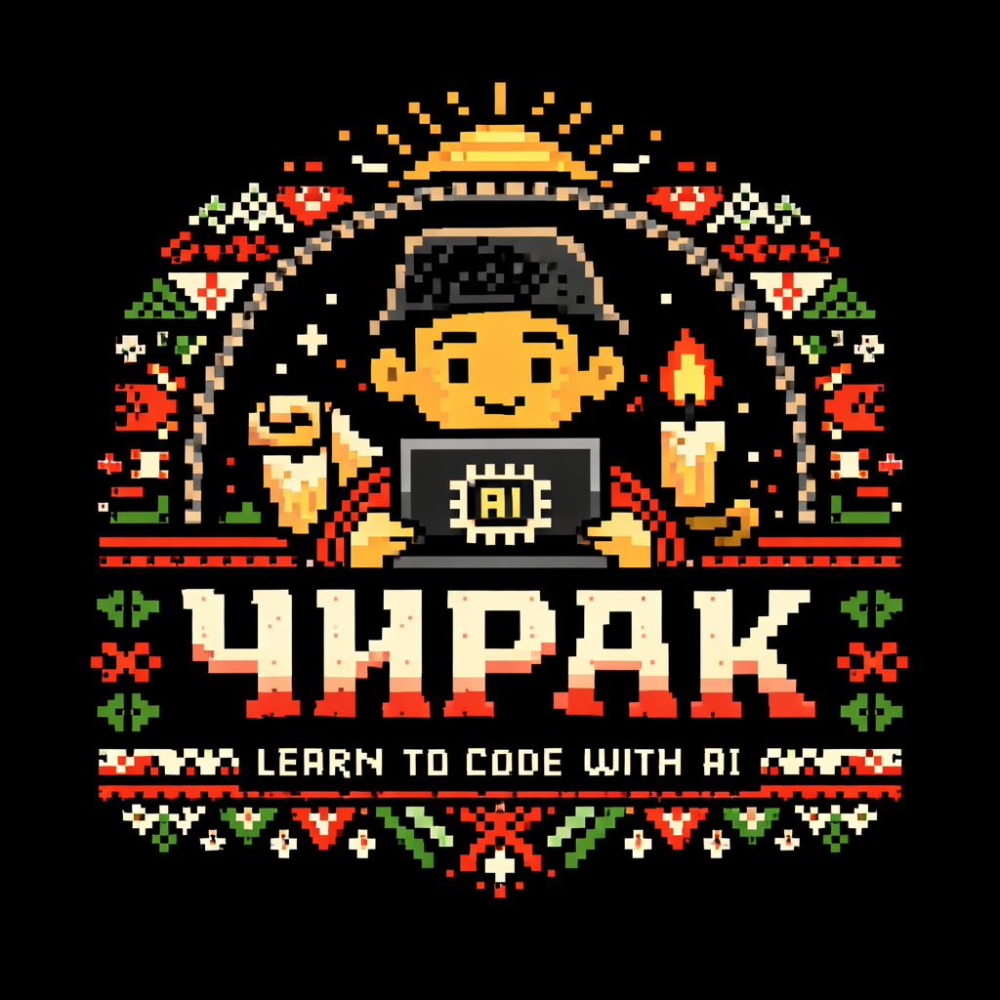

# чирак / chirak



> *A Claude Code plugin that turns Claude into a guided partner for learning AI-assisted development.*

```
╔══════════════════════════════════════════════╗
║   ч и р а к   —   the apprentice framework  ║
║                                              ║
║   чирак  →  калфа  →  майстор               ║
║   chirak →  kalfa  →  maystor               ║
║  apprentice → journeyman → master           ║
╚══════════════════════════════════════════════╝
```

[](LICENSE)

---

## What is this?

Chirak is a Claude Code plugin and course format that teaches you how to build real projects with AI. Claude does the coding — you learn how to direct it effectively: how to break goals into steps, write clear prompts, evaluate output, and ship things.

**There is no framework to run.** No CLI to install. Just files that drop into your project and change how Claude behaves inside it.

The name comes from the Bulgarian craft guild tradition: **чирак** (chirak, apprentice) works under a **майстор** (maystor, master), progresses to **калфа** (kalfa, journeyman), and eventually earns the title of master through demonstrated skill — not time served.

---

## Installing the Plugin

```bash
/plugin marketplace add velislavgerov/chirak
/plugin install chirak@velislavgerov-chirak
```

Or manually, using the init script:

```bash
# Demo course — build a personal page
mkdir my-page && cd my-page
bash <(curl -s https://raw.githubusercontent.com/velislavgerov/chirak/main/scripts/init.sh) demo

# Your own project
mkdir my-project && cd my-project
bash <(curl -s https://raw.githubusercontent.com/velislavgerov/chirak/main/scripts/init.sh) your-project
```

Then open Claude Code and start:

```bash
claude
# then type:
/chirak:brief
```

---

## How It Works

```
┌─────────────────────────────────────────────────────────────────┐
│  Your Project                                                   │
│                                                                 │
│  CLAUDE.md ──────────────────── sets the майстор persona        │
│                                 Claude does the work, teaches   │
│                                 the process                     │
│                                                                 │
│  .claude/commands/chirak/        slash commands (plugin)        │
│    ├── brief.md  (/chirak:brief) show lesson objectives         │
│    ├── check.md  (/chirak:check) evaluate your work             │
│    ├── hint.md   (/chirak:hint)  prompting tips                 │
│    ├── next.md   (/chirak:next)  advance to next lesson         │
│    ├── status.md (/chirak:status)show progress                  │
│    ├── dive.md   (/chirak:dive)  deep-dive on a concept         │
│    └── create-course.md          author a new course            │
│                                                                 │
│  courses/<course>/               the course you're taking       │
│    ├── course.yaml               lessons, objectives, evals     │
│    └── lessons/                                                 │
│        ├── 01-*/lesson.md                                       │
│        └── ...                                                  │
│                                                                 │
│  .chirak/progress.json           where you are, what you've tried│
└─────────────────────────────────────────────────────────────────┘
                              │
                              │  Claude Code reads all of this
                              ▼
                    ┌──────────────────┐
                    │   Claude Code    │
                    │   (the майстор)  │
                    └──────────────────┘
```

When you open Claude Code in a Chirak project, Claude reads `CLAUDE.md`, `course.yaml`, and `progress.json`. It knows what lesson you're on, what to build with you, and how to teach through doing rather than explaining.

---

## Quick Start

### Option 1 — Demo course (pre-defined project)

Build a personal page in ~30 minutes. The project is pre-defined — a personal page — but you choose the details: what to put on it, which tech stack, how to deploy it.

```bash
mkdir my-page && cd my-page
bash <(curl -s https://raw.githubusercontent.com/velislavgerov/chirak/main/scripts/init.sh) demo
claude
# then type:
/chirak:brief
```

### Option 2 — Your own project

Start with a conversation. You decide what to build. Claude helps you scope it. The rest of the course adapts to whatever you chose.

```bash
mkdir my-project && cd my-project
bash <(curl -s https://raw.githubusercontent.com/velislavgerov/chirak/main/scripts/init.sh) your-project
claude
# then type:
/chirak:brief
```

### Or locally from this repo

```bash
git clone https://github.com/velislavgerov/chirak.git
./chirak/scripts/init.sh demo ./my-page
cd my-page && claude
```

---

## The Commands

Once installed, these slash commands are available inside Claude Code:

| Command | What it does |
|---------|-------------|
| `/chirak:brief` | Show the current lesson's objectives and what you'll build together |
| `/chirak:check` | Evaluate your work against the lesson criteria |
| `/chirak:hint` | Prompting tips — `/chirak:hint more` for direction, `/chirak:hint show` for an example prompt |
| `/chirak:next` | Advance to the next lesson (only after passing `/chirak:check`) |
| `/chirak:status` | Show overall progress, lessons completed, hints used |
| `/chirak:dive [concept]` | Deep-dive on a concept, or list available learning moments and references |
| `/chirak:create-course` | Interactive guide for writing a new Chirak course |

---

## The Courses

### `demo` — Your First Ship

**Rank: чирак / chirak**

Go from zero to a live personal page. The project is pre-defined — a personal page — but you choose the details: what to put on it, which tech stack, how to deploy it.

Five lessons:
1. **What Are We Building?** — Tell Claude what you want, Claude writes the README and scopes the project
2. **Get It Running** — Claude scaffolds the project, you review and request changes
3. **Ship It** — Claude configures deployment, you connect and push
4. **Trust But Verify** — Claude writes the tests and CI, you understand what they check
5. **Change Without Fear** — Claude adds your chosen feature, you ship it and write a reflection

### `your-project` — Ship Something You Need

**Rank: чирак / chirak**

Same development cycle, but you choose what to build. Lesson 1 is a scoping conversation — Claude helps you find a project that's achievable, real, and worth building. The rest adapts to whatever you chose: web app, CLI, API, library, script.

Five lessons:
1. **What Are You Going to Build?** — Scoping conversation + README
2. **Get It Running** — Claude scaffolds for your specific project type
3. **Ship It** — Deploy or publish, in whatever form fits your project
4. **Trust But Verify** — Tests and CI adapted to your stack
5. **Change Without Fear** — Improve it, ship it, reflect

---

## The Progression System

Rank is earned through demonstrated work, not time served.

| Bulgarian | Pronunciation | Meaning | What it means here |
|-----------|--------------|---------|-------------------|
| **чирак** | chirak | apprentice | Foundational courses. You're learning the craft. |
| **калфа** | kalfa | journeyman | Intermediate courses. You can work independently. |
| **майстор** | maystor | master | Advanced courses. You can teach others. |

Completing чирак-rank courses unlocks калфа-rank courses (coming soon).

---

## Writing a Course

The `/chirak:create-course` command lets you author a new course interactively inside Claude Code. Claude guides you through defining lessons, writing objectives, specifying evaluation criteria, and adding learning moments and references.

See [docs/authoring.md](docs/authoring.md) for the full guide.

---

## Repository Structure

```
chirak/
├── .claude-plugin/
│   └── plugin.json            # Plugin manifest
├── commands/                  # Claude Code plugin commands
│   ├── brief.md               # /chirak:brief
│   ├── check.md               # /chirak:check
│   ├── hint.md                # /chirak:hint
│   ├── next.md                # /chirak:next
│   ├── status.md              # /chirak:status
│   ├── dive.md                # /chirak:dive
│   └── create-course.md       # /chirak:create-course
├── skills/
│   └── maystor/
│       └── SKILL.md           # Auto-discovered skill — майстор persona
├── courses/
│   ├── demo/                  # "Your First Ship" — deploy a personal page
│   └── your-project/          # "Ship Something You Need" — open-ended
├── templates/
│   └── CLAUDE.md              # The майстор persona — copied into learner's project
├── scripts/
│   └── init.sh                # Manual install script
├── docs/
│   ├── architecture.md        # How it all fits together
│   └── authoring.md           # How to write a Chirak course
└── assets/
    └── chirak-logo.png
```

---

## Contributing

### Writing Courses

The highest-leverage contribution is authoring courses. A good Chirak course:

- Teaches by doing — every lesson ends with something built
- Has evaluation criteria that verify real understanding, not just task completion
- Reads like a craftsperson explaining their art, not like documentation
- Trusts the learner to direct Claude; teaches the directing, not the coding

Use `/chirak:create-course` to get started, or see [docs/authoring.md](docs/authoring.md).

### Improving the Commands

The commands (`commands/*.md`) are instructions to Claude. Improving them means better guidance, better evaluation, better hints. Open a PR with your proposed changes and explain what behavior it improves.

---

## License

MIT — see [LICENSE](LICENSE).

---

```
майстор казва: "Покажи, не разказвай."
maystor says: "Show, don't tell."
```
